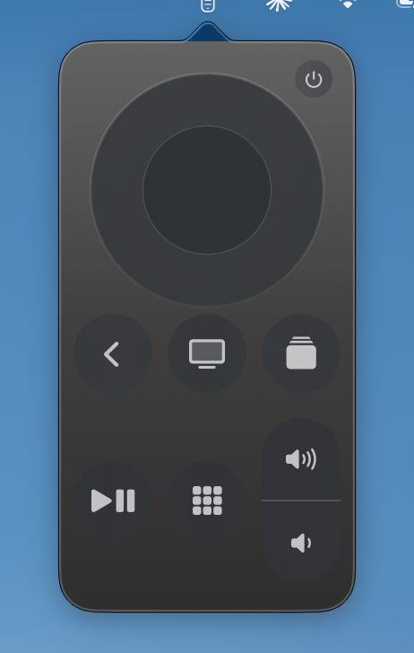
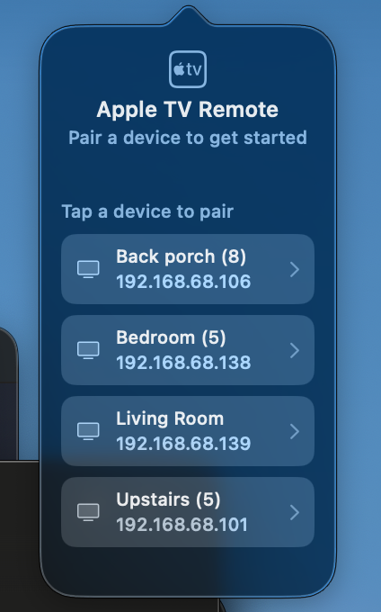
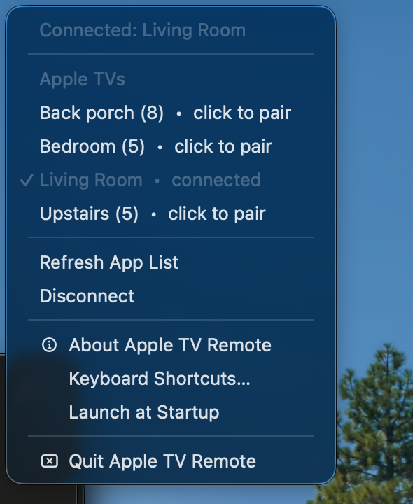
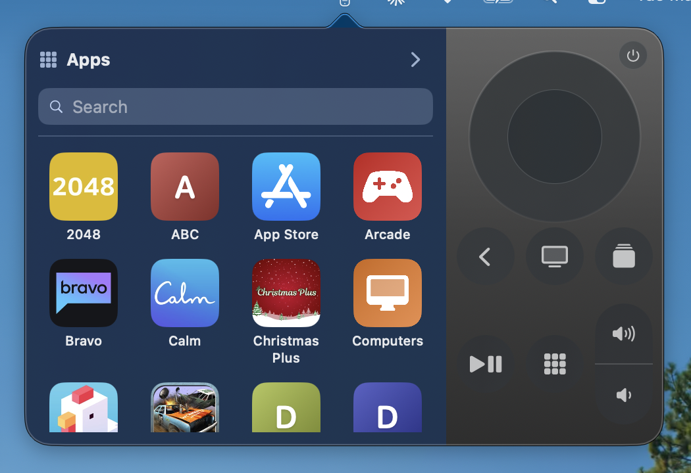

# <picture><source media="(prefers-color-scheme: dark)" srcset="assets/icon-dark.png"></picture> Apple TV Remote

A macOS menu-bar Apple TV remote. Click the icon, get a Siri Remote–style
drop-down; tap, swipe, or use the trackpad to drive your Apple TV. No
Python, no helper processes — pure Swift talking to Apple TVs over the
reverse-engineered **Companion** and **MRP** protocols.

> **Origin:** based on [**alokdhir/appletv-remote**](https://github.com/alokdhir/appletv-remote).
> The protocol implementation (`AppleTVProtocol`), connection logic
> (`CompanionConnection`, `DeviceDiscovery`, `AutoReconnector`), app
> launcher backend, keyboard-input handling, and `atv` CLI all come from
> upstream. **This fork's contribution is the UI**: the main-window +
> sidebar layout was replaced with a compact menu-bar drop-down (the
> Siri Remote–style face, slide-out app launcher panel, floating
> text-input window, right-click device menu).

<p align="center">
  
</p>

## Features

- **Menu-bar drop-down** — Siri Remote face that drops from the menu bar.
  Light + dark mode aware.
- **Right-click context menu** — list of every discovered Apple TV with
  ✓ for the connected one, "paired" / "click to pair" markers; one-click
  switching between paired devices without re-entering a PIN.
- **Trackpad gestures** — 2-finger swipe on the trackpad while the popover
  is open sends directional input. Or click and drag across the clickpad.
- **Power button**, **Siri hold-to-talk**, **volume rocker**, **play/pause**,
  **home**, **back**.
- **App launcher** — slide-out panel to the left of the remote; browse the
  apps installed on the Apple TV, search, tap to launch.
- **Keyboard text input** — when the Apple TV opens a text field, a small
  floating window pops up; type into it and it appears on the TV.
- **Auto-reconnect** — reconnects automatically when an Apple TV that was
  previously connected becomes reachable again.
- **`atv` CLI companion** — scriptable control from the terminal (`atv u`,
  `atv home`, `atv launch com.apple.TVMovies`, etc.).

## Screenshots

<table>
  <tr>
    <td align="center" valign="top">
      <br>
      <sub>Pairing view — pick a discovered Apple TV to start pairing.</sub>
    </td>
    <td align="center" valign="top">
      <br>
      <sub>Connected — Siri-Remote face with clickpad, button rows, power.</sub>
    </td>
    <td align="center" valign="top">
      <br>
      <sub>Right-click the icon for the device list, paired/connected markers, one-click switching.</sub>
    </td>
  </tr>
  <tr>
    <td align="center" valign="top" colspan="3">
      <br>
      <sub>App launcher slides out to the left; tap an app to launch on the TV.</sub>
    </td>
  </tr>
</table>

## Install

Grab the latest DMG from the
[Releases page](https://github.com/alokdhir/appletv-remote/releases/latest).

1. Download `AppleTVRemote-X.Y.Z.dmg`.
2. Double-click to mount. Drag **AppleTVRemote.app** onto the **Applications**
   shortcut.
3. First launch: the app is ad-hoc signed (no Apple Developer Program),
   so macOS Gatekeeper will refuse to open it. Two ways past it:
   - Right-click `AppleTVRemote.app` in `/Applications` → **Open** →
     confirm in the dialog. macOS remembers the decision.
   - Or run once: `xattr -dr com.apple.quarantine /Applications/AppleTVRemote.app`
4. *(Optional `atv` CLI)*: open a Terminal in the mounted DMG and run
   `./install.sh` — copies the app to `/Applications` and the CLI to
   `/usr/local/bin/atv` in one go.

## First-run pairing

1. Click the **remote icon** in the menu bar (top-right of the screen).
2. The popover drops down with "Pair a device to get started." It auto-scans
   your network via Bonjour.
3. Tap a discovered Apple TV. The Apple TV will display a 4-digit PIN
   on screen.
4. Type the PIN into the popover. It auto-submits on the 4th digit.
5. Credentials are saved (see [Credential storage](#credential-storage));
   next launch the app auto-connects to the last-used device.

## Usage

- **Left-click** the menu-bar icon → remote drops down.
- **Right-click** → context menu with the device list, "Refresh App List",
  "Disconnect", "About", "Keyboard Shortcuts…", "Launch at Startup", "Quit".
- **Tap clickpad** ring → directional press. **Tap centre** → select.
  **Click and drag** across the clickpad → continuous direction (one
  press per ~22pt of drag).
- **Long-press clickpad centre** (>500ms) → home-screen **edit-apps**
  mode (the "wiggle apps to rearrange" gesture).
- **Top-right power button** → **toggles** the Apple TV between sleep
  and wake. The toggle state resets to "awake" whenever the connection
  becomes `.connected` (you can't be connected to a sleeping TV).
- **Back button** — tap → menu (back); **long-press** (>500ms) →
  screensaver.
- **App Switcher button** (stack-of-cards icon, second row) → tvOS's
  app switcher (`sendLongPress(.home)`). *Note: not Siri — the
  Companion protocol has no Siri trigger keycode.*
- **Apps button** (square grid icon in the second row) → app-launcher
  slide-out from the left of the remote.

### Now Playing

When the Apple TV is playing something, a compact banner appears at the
top of the popover with the title, artist / app name, and a thin
elapsed/duration progress bar. The popover grows taller to accommodate
it; closes back when the TV idles. Driven by
`CompanionConnection.$nowPlaying` (updated by the AirPlay tunnel).

### Trackpad navigation

While the popover is open, you can drive the Apple TV without ever
moving the cursor onto the remote face:

| Gesture | What it does | How it works |
|---|---|---|
| **2-finger swipe** ↑↓←→ | Discrete directional press (`up`/`down`/`left`/`right`) | An `NSEvent.scrollWheel` local monitor accumulates trackpad deltas; once 60pt of motion lands in one axis it fires one arrow and resets that axis. Momentum (post-release) events are ignored. Mouse wheels are filtered out (`hasPreciseScrollingDeltas`). |
| **⌥ Option + 2-finger swipe** ↑↓←→ | Plain `sendSwipe` (touchpad-flick gesture). Larger amplitude per fire than an arrow — useful for momentum scrolling through long lists. Doesn't pause/unpause playback (no select-press). | Modifier is captured at the swipe session's `.began` phase so a mid-swipe release doesn't flip behaviour. Threshold drops to 25pt so a normal Option-swipe fires multiple flicks. Rate-limited to one per 400ms to prevent overlapping touch sessions on the tvOS side. |
| **2-finger click** | Sends `select` | macOS dispatches a 2-finger click as `.rightMouseDown` by default. The monitor catches it and fires `select`. Right-clicking the **menu-bar icon** still opens the context menu — those clicks are filtered out by checking `event.window`. |

All three gestures are scoped to popover lifetime: the event monitor is
installed when the popover opens (`popoverDidShow`) and removed when it
closes. So they won't interfere with normal trackpad behaviour
elsewhere on your Mac.

The vertical sign for swipes is empirically calibrated so finger-up
sends `up` regardless of your "Natural scrolling" preference. The
monitor lives in [`MenuBarController.swift`](Sources/AppleTVRemote/MenuBarController.swift)
under "Trackpad swipe-to-arrow"; tunable knobs there:

- `scrollSwipeThreshold` (60pt) — arrow-press distance per fire (plain swipe).
- Option-held threshold (25pt) — flick-gesture distance per fire (Option-swipe).
- `optionSwipeMinInterval` (0.4s) — rate-limit between Option-held flicks.

## Launch at startup

Right-click the menu-bar icon → toggle **Launch at Startup**. Uses Apple's
modern `SMAppService.mainApp` Service Management API to register the app
as a Login Item with macOS — no `launchd` plist editing, no Login Items
GUI required.

A few caveats for the ad-hoc-signed build:

- **Install to `/Applications/` first.** `SMAppService.mainApp` ties
  registration to a stable bundle path. Run from `~/Downloads` or
  elsewhere and macOS may register it but skip the actual relaunch at
  login.
- **First time you toggle it on**, macOS may surface a confirmation
  in System Settings → General → Login Items. Approve there.
- **If you rebuild + replace the `.app`**, toggle Launch-at-Startup off
  and back on — the ad-hoc signature changes, which can invalidate the
  stored registration.

To verify the registration:

```sh
open "x-apple.systempreferences:com.apple.LoginItems-Settings.extension"
# AppleTVRemote should appear under "Open at Login".
```

## Requirements

- macOS 13+
- Apple TV (HD / 4K) on the same local network
- Xcode 26 / Swift 6 *(only to build from source)*

## Building from source

The Xcode project is a thin wrapper around `Package.swift` — `swift build`
is the canonical build path; the script below also wraps the binary into a
real `.app` bundle.

```bash
# Debug build (fast, no .app wrap)
swift build

# Tests
swift test

# Release .app + DMG with drag-to-Applications layout
scripts/build-dmg.sh        # → dist/AppleTVRemote-<date>.dmg (~6 MB)
```

By default `build-dmg.sh` produces an **unsigned + ad-hoc** build — no
Apple Developer Program subscription needed. Pass a real Developer ID and
notarytool profile via env vars to opt into a signed + notarized build
(see the script header for examples).

## `atv` CLI Reference

```bash
# Discovery & setup
atv list               # list discovered Apple TVs
atv status             # connection state + now-playing
atv pair <name>        # pair with an Apple TV (prompts for PIN)
atv select <name>      # set default device for subsequent commands

# Navigation
atv u / d / l / r      # D-pad up / down / left / right
atv click              # D-pad centre (select)
atv menu               # menu / back
atv home               # home button
atv sl / sr / su / sd  # trackpad swipe left/right/up/down

# Playback & volume
atv pp                 # play/pause
atv vol+ / vol-        # volume up/down
atv power              # wake if asleep, sleep if on

# App launcher
atv apps               # list installed apps
atv launch <bundleID>  # launch an app by bundle ID

# Chaining
atv 3 r                # repeat right × 3
atv r u d              # right, then up, then down

# Standalone mode (no app required — connects directly)
atv --standalone apps
atv --standalone --device "Living Room" l
```

## Credential storage

Pairing credentials (Ed25519 long-term key pair + Apple TV public key) are
stored as JSON in:

```
~/Library/Application Support/AppleTVRemote/<device-id>.json         # Companion
~/Library/Application Support/AppleTVRemote/<device-id>.airplay.json # AirPlay
```

**Security note:** The Ed25519 private key (`ltsk`) is stored in plaintext.
The files are written with `0600` permissions (owner read/write only).

## Architecture

### `Sources/AppleTVRemote/` — SwiftUI app

| File | Role |
|------|------|
| `AppleTVRemoteApp.swift` | `@main` entry point; menu-bar-only (no `WindowGroup`); owns `DeviceDiscovery`, `CompanionConnection`, `AutoConnectStore`, `AutoReconnector` |
| `MenuBarController.swift` | `NSStatusItem` + `NSPopover` host; right-click context menu; observes `RootView` size-change notification to resize the popover when the app-launcher slide-out toggles |
| `DeviceDiscovery.swift` | Bonjour browser (`_companion-link._tcp`) via `NWBrowser` |
| `CompanionConnection.swift` | Connection state machine, pair-setup / pair-verify, command dispatch |
| `AutoReconnector.swift` + `AutoConnectStore.swift` | Reconnect-when-reachable behaviour |
| `RootView.swift` | Top-level popover router. Picks pairing UI vs remote UI from `connection.state`; manages app-launcher slide-out |
| `RemoteView.swift` | Aluminum-bodied Siri Remote face |
| `ClickpadView.swift` | Circular clickpad with tap-quadrant + drag-swipe gestures |
| `RemoteButtonsView.swift` | Back / Home / Mic / Play-Pause / Apps / Volume rocker |
| `PairingView.swift` | Disconnected device list + PIN entry |
| `AppLauncherPanel.swift` | Slide-out app grid driven by `connection.appList` + `AppIconCache` |
| `TextInputWindow.swift` | Floating window opened when the Apple TV opens a text field |
| `RemoteSession.swift` | Thin bridge from view-layer commands to `CompanionConnection` API |
| `RemoteTheme.swift` | Visual constants (sizes, gradients, animations) |
| `IPCServer.swift` | Unix-socket IPC for the `atv` CLI |

### `Sources/AppleTVProtocol/` — protocol implementation

The cryptography (SRP-6a / Ed25519 / Curve25519 / ChaCha20-Poly1305), TLV8 /
OPACK / protobuf wire formats, MRP and Companion frame layers, AirPlay
tunnelling, and credential storage. ~6 KLOC of Swift, no external deps
beyond `BigInt`.

### `Sources/atv/` — CLI

Standalone executable that either talks to the running GUI app via the
Unix-socket `IPCServer`, or (with `--standalone`) opens its own connection
using `AppleTVProtocol` directly.

## License

[MIT](LICENSE).

## Acknowledgements

- [**alokdhir/appletv-remote**](https://github.com/alokdhir/appletv-remote) —
  the upstream project this fork is derived from. The entire Swift protocol
  implementation, connection state machine, app launcher, text-input
  notification flow, and CLI tool originate there. This fork only replaces
  the GUI.
- [pyatv](https://github.com/postlund/pyatv) — the protocol reference
  implementations the upstream Swift port followed.
- [BigInt](https://github.com/attaswift/BigInt) by Károly Lőrentey — SPM
  dependency used for SRP-6a big-integer math.
